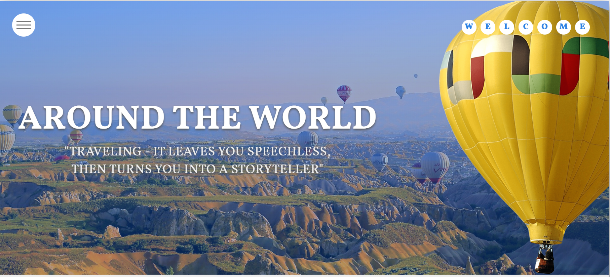
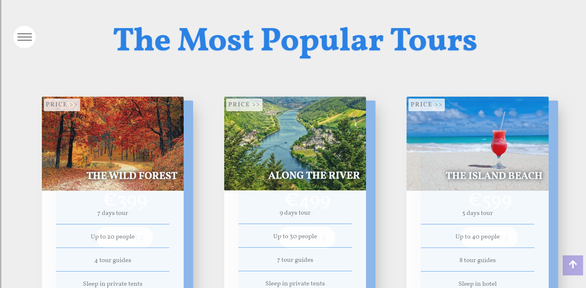
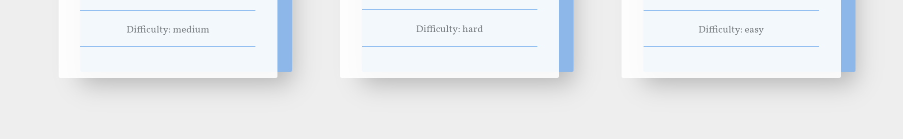
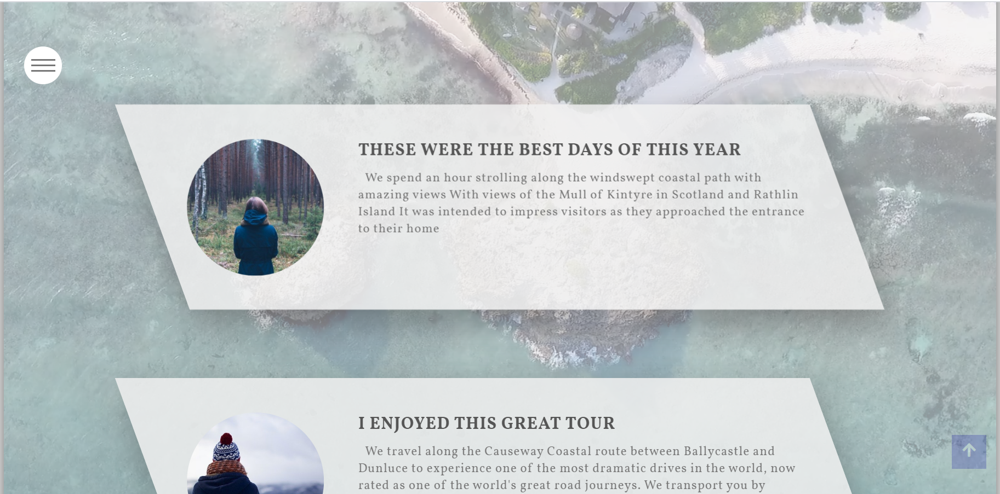
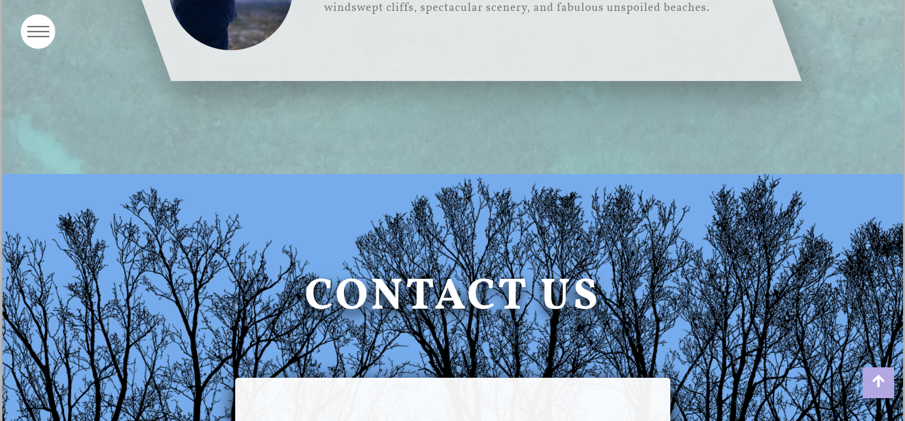
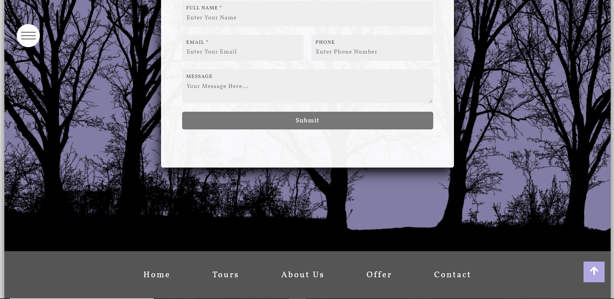

## Interactive Frontend Development Milestone Project

# Travel Lovers 
This is a front-end website called "Travel Lovers " 

## This website was created as a project for Code Institute. To view the live site, [CLICK HERE](https://abdoelsaih.github.io/Interactive-Frontend-Development-Milestone-Project/index.html)

## About the website
Travel tours around the world, shares stories and most popular tours

## Features 
- Tour offers and information 
- Google Map
- Beautiful background 
- Contact us form
Google maps javascript api
## Mobile-responsive
- The webpages work on small to medium devices (i.e. mobile phones to laptops).

## Technologies Used
- HTML and CSS 
- [JavaScript](https://www.w3schools.com/js/)
- [Google Map API](https://developers.google.com/maps/documentation/javascript/tutorial)
- [javascript Marker Clustering](https://developers.google.com/maps/documentation/javascript/marker-clustering)
- [Pexels](https://www.pexels.com/search/free%20download/) - free download photos
- [Font Awesome](https://use.fontawesome.com/releases/v5.4.1/css/all.css) - font used 
- [Google Font](https://fonts.googleapis.com/css?family=Vollkorn:400,400i,600,700,900&display=swap) - font used 

## Testing
- [W3C](http://validator.w3.org/#validate_by_uri) - Validate by direct input
- Site tested on these browsers: Google Chrome - Internet Explorer - Mozilla Firefox - Microsoft Edge - Safari

## Deployment
- The website was published using [GitHub pages](https://abdoelsaih.github.io/Interactive-Frontend-Development-Milestone-Project/index.html)

## Acknowledgements
- I received inspiration for this website from other developers and especially from kids after watching the videos on the webpage 

